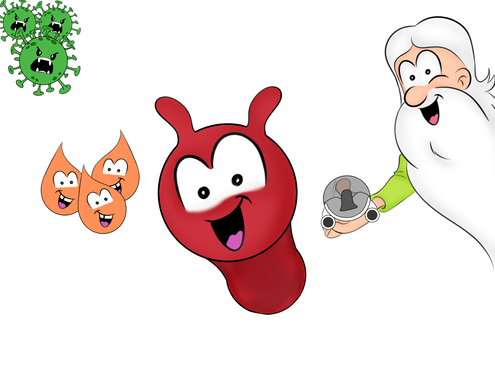

<a name="readme-top"></a>

<!-- PROJECT LOGO -->
<br />
<div align="center">
  <a href="https://github.com/adribasterra/Education-game">
    
  </a>

<h3 align="center"><strong>Education Game</strong></h3>

  <p align="center">
    Game to educate about the human body
    <br />
    <a href="https://github.com/adribasterra/Education-game"><strong>Explore repository »</strong></a>
    <br />
    <br />
  </p>
</div>

<!-- TABLE OF CONTENTS -->
<details>
  <summary>Table of Contents</summary>
  <ol>
    <li>
      <a href="#about-the-project">About The Project</a>
      <ul>
        <li><a href="#built-with">Built With</a></li>
      </ul>
    </li>
    <li>
      <a href="#getting-started">Getting Started</a>
      <ul>
        <li><a href="#prerequisites">Prerequisites</a></li>
        <li><a href="#installation">Installation</a></li>
      </ul>
    </li>
  </ol>
</details>

<br>

<!-- ABOUT THE PROJECT -->

## 📌 About The Project

![Product Screenshot][product-screenshot]

This project was created for young people and children about the human body. It consists of several chapters, the first one being about the **bloodstream**. In it, there are 3 levels, corresponding to 3 different cells:
- red blood cells
- white blood cells
- platelets

The function of each cell is told in an interactive and fun way to promote learning.

All art and development has been done by the team. From concepts, models, animations to logic.

<p align="right">(<a href="#readme-top">back to top</a>)</p>

### Built With

<div align="center">

[![Unity][unity]][unity-url]

</div>

- **Unity** is used as videogame engine

<p align="right">(<a href="#readme-top">back to top</a>)</p>

<!-- GETTING STARTED -->

## 🔭 Getting Started

To get a local copy up and running follow these example steps.

### Prerequisites

Some programs need to be installed in order to use the software. This is how to install them.

- Unity 2021.11.14f1 [Download](https://unity.com/download)

### Installation

1. Clone the repo
   ```sh
   git clone https://github.com/adribasterra/Education-game.git
   ```
2. Open project in Unity Hub. Packages will be installed

<p align="right">(<a href="#readme-top">back to top</a>)</p>

---

<!-- MARKDOWN LINKS & IMAGES -->

[product-screenshot]: Assets/product.png
[unity]: https://img.shields.io/badge/Unity-100000?style=for-the-badge&logo=unity&logoColor=white
[unity-url]: https://unity.com/
